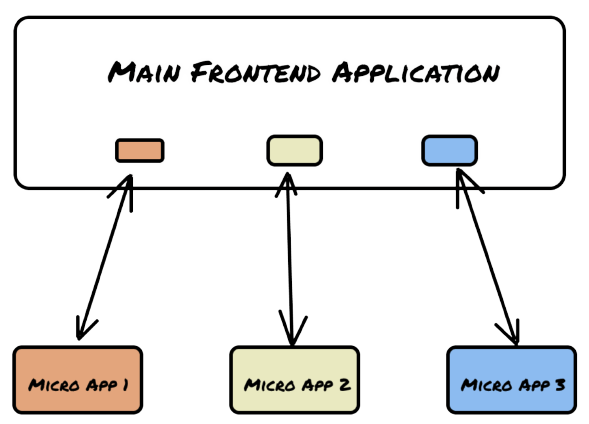

# 🎩 Micro Frontend Nedir ?

Micro Frontends, günümüzde modern web uygulamalarının daha verimli ve esnek bir şekilde geliştirilmesine yardımcı olan bir mimari yaklaşımdır. Bu yaklaşım, farklı ekiplerin bağımsız olarak çalışabileceği ve uygulamanın farklı bileşenlerini ayrı ayrı yönetebileceği bir yapı sunar. İşte Micro Frontends mimarisini daha iyi anlayabilmeniz için bazı anahtar noktalar:

1. Etkileşim: Micro Frontends mimarisi, uygulamanın modüllerini veya parçalarını dikey ve yatay alanlarda bölmeyi hedefler. Bu sayede, farklı modüller arasındaki etkileşim azaltılır ve ekipler daha bağımsız bir şekilde çalışabilir.
2. Gereksinimler: Uygulamanın bileşenleri veya bileşen grupları arasında performans, hız, güvenlik gibi gereksinimlerde farklılık olması durumunda Micro Frontends mimarisi oldukça avantajlıdır. Bu sayede her bir bileşen, kendi gereksinimlerine göre optimize edilebilir.
3. Organizasyonel Yapı: Micro Frontends, uygulamanın bileşenlerinin microservis olarak ayrı ekipler tarafından yönetilmesine olanak tanır. Bu da ekiplerin kendi geliştirme takvimlerine sahip olmasını ve daha bağımsız bir şekilde çalışmasını sağlar.
4. Canlıya Çıkma Süreci: Micro Frontends mimarisi, bileşen geliştirme, bakım ve canlıya çıkma süreçlerini birbirinden ayırarak bağımsız hale getirir. Bu sayede, her bir bileşenin güncelleme ve bakımı daha kolay ve hızlı bir şekilde gerçekleştirilebilir.
5. Teknoloji: Micro Frontends, farklı diller, kütüphaneler ve framework'lerin kullanılmasına olanak tanır. Bu sayede ekipler, kendilerine en uygun teknolojileri kullanarak çalışabilirler.

Micro Frontends mimarisinde, farklı ekipler tarafından geliştirilen bileşenler, iFrame, Federation, Fragment gibi yapılar kullanılarak bir Container (Shell) içerisinde birleştirilir. Bu sayede, uygulama daha modüler, esnek ve kolay yönetilebilir bir hale gelir.

Sonuç olarak, Micro Frontends mimarisi, modern web uygulamalarının geliştirilmesinde büyük avantajlar sunan bir yaklaşımdır. Bu sayede ekipler, daha bağımsız ve esnek bir şekilde çalışarak, uygulamanın farklı bileşenlerini daha verimli bir şekilde yönetebilir ve optimize edebilir.

<figure><figcaption>
Micro Frontend 
</figcaption></figure>

## Referanslar 

[https://medium.com/frontend-development-with-js/scalable-frontend-geli%C5%9Ftirmelerinde-micro-frontend-yakla%C5%9F%C4%B1mlar%C4%B1-framework-ve-pluginler-8d0e5773c34f](https://medium.com/frontend-development-with-js/scalable-frontend-geli%C5%9Ftirmelerinde-micro-frontend-yakla%C5%9F%C4%B1mlar%C4%B1-framework-ve-pluginler-8d0e5773c34f)
